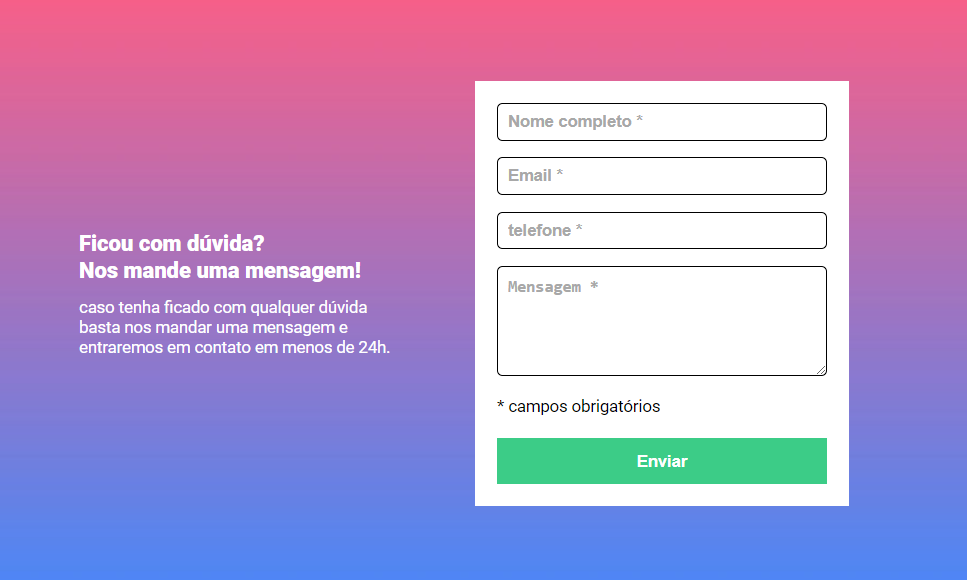
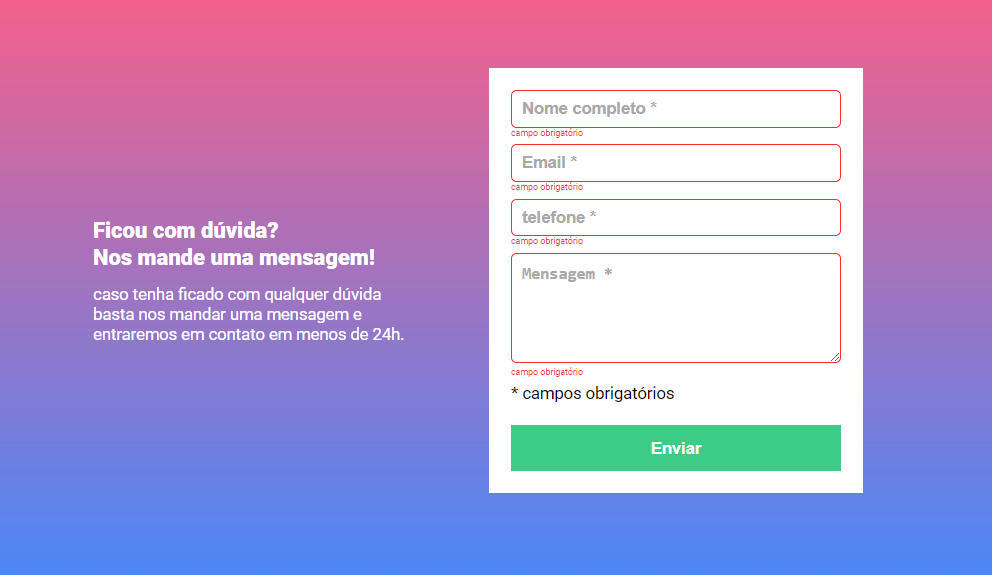

# Projeto de Formulário com Validação em JavaScript

Este é um projeto simples de formulário web que utiliza HTML, CSS e JavaScript para criar um formulário interativo com validação de dados. O objetivo principal é certificar de que os campos obrigatórios são preenchidos antes de enviar o formulário. Se não, mostrar uma mensagem de obrigatoriedade ao cliente.

## Conteúdo

- [Visão geral](#visão-geral)
    - [Captura de tela](#captura-de-tela)
    - [Estrutua do projeto](#estrutura-do-projeto)
- [O processo](#o-processo)
    - [Construído com](#construido-com)
    - [O desafío](#o-desafio)
    - [Como usar](#como-usar)

## Visão geral

### Captura de tela

### Estrutura do projeto

* **index.html:** Contem a estrutura do formulário.
* **style.css:** Estiliza o formulário para uma melhor experiência do usuário.
* **reset.css:** Reseta as configurações padrões do css.
* **script.js:** Implementa a lógica de validação do formulário usando o javascript.
* **README.md:** Documentação do projeto (você está lendo isso!).

## O processo

### Construído com

- HTML Semântico;
- CSS;
- Flexbox;
- JavaScript;

### O desafío

Além de criar uma boa estrutura HTML com tags semânticas, estilizar para um visual aconchegante aos olhos do usuário, o maior desafío foi a criação do javascript para validação caso o formulário tenha alguma entrada em branco.

### Como usar

1. Clone ou faça o download desse repositório.
2. Abra o arquivo **'index.html'**
em seu navegador.

